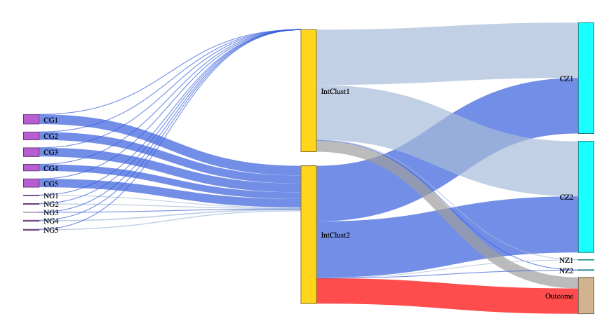
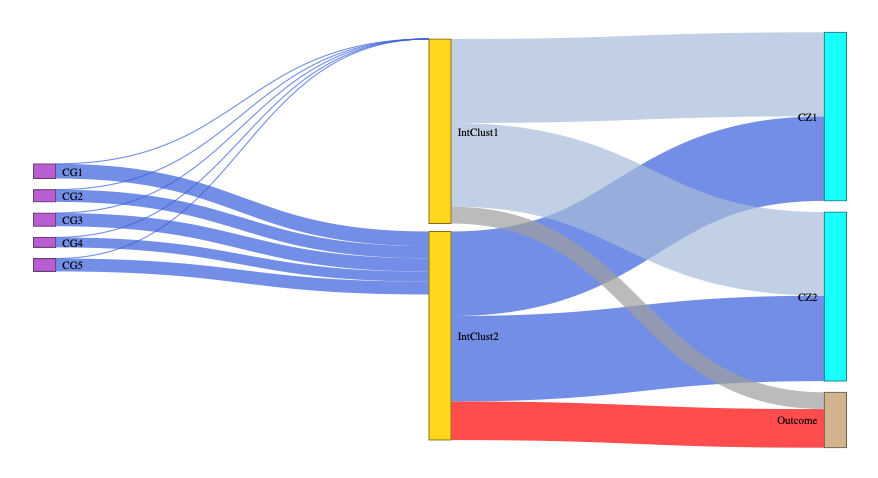

LUCIDus: Latent Unknown Clustering with Integrated Data
================

[](https://travis-ci.org/USCbiostats/LUCIDus)
[](https://cran.r-project.org/package=LUCIDus)


<!-- README.md is generated from README.Rmd. Please edit that file -->

## Introduction

The LUCIDus R package is an integrative tool to obtain a joint
estimation of latent or unknown clusters/subgroups with multi-omics data
and phenotypic traits. This package is an implementation for the novel
statistical method proposed in the research paper “[A Latent Unknown
Clustering Integrating Multi-Omics Data (LUCID) with Phenotypic
Traits](https://doi.org/10.1093/bioinformatics/btz667)” published by the
*Bioinformatics*.

## Citation

Cheng Peng, Jun Wang, Isaac Asante, Stan Louie, Ran Jin, Lida Chatzi,
Graham Casey, Duncan C Thomas, David V Conti, A Latent Unknown
Clustering Integrating Multi-Omics Data (LUCID) with Phenotypic Traits,
Bioinformatics, , btz667,
<https://doi.org/10.1093/bioinformatics/btz667>

## Installation

You can install the released version of LUCIDus from
[CRAN](https://CRAN.R-project.org/package=LUCIDus) directly with:

``` r
install.packages("LUCIDus")
```

Or, it can be installed from GitHub using the following codes:

``` r
install.packages("devtools")
devtools::install_github("USCbiostats/LUCIDus")
```

## Fitting the latent cluster models

``` r
library(LUCIDus)
```

Three functions, including `est_lucid()`, `boot_lucid()`, and
`tune_lucid()`, are currently available for model fitting and selection.
The model outputs can be summarized and visualized using
`summary_lucid()` and `plot_lucid()` respectively. Predictions could be
made with `pred_lucid()`.

### `est_lucid()`

Estimating latent clusters with multi-omics data

#### Example

For a testing dataset with 10 genetic features (5 causal) and 4
biomarkers (2 causal)

##### Integrative clustering without feature selection

``` r
set.seed(10)
IntClusFit <- est_lucid(G=G1,Z=Z1,Y=Y1,K=2,family="binary",Pred=TRUE)
```

#### Checking important model outputs with `summary_lucid()`

``` r
summary_lucid(IntClusFit)
```

#### Visualize the results with Sankey diagram using `plot_lucid()`

``` r
plot_lucid(IntClusFit)
```



#### Re-run the model with covariates in the G-\>X path

``` r
IntClusCoFit <- est_lucid(G=G1,CoG=CoG,Z=Z1,Y=Y1,K=2,family="binary",Pred=TRUE)
```

#### Check important model outputs

``` r
summary_lucid(IntClusCoFit)
```

#### Visualize the results

``` r
plot_lucid(IntClusCoFit)
```

### `boot_lucid()`

Bootstrap method to achieve SEs for LUCID parameter estimates

#### Example

``` r
set.seed(10)
boot_lucid(G = G1, CoG = CoG, Z = Z1, Y = Y1, CoY = CoY, useY = TRUE, family = "binary", K = 2, R=500)
```

### `tune_lucid()`

#### Example

Grid search for tuning parameters using parallel computing

``` r
# Better be run on a server or HPC
set.seed(10)
GridSearch <- tune_lucid(G=G1, Z=Z1, Y=Y1, K=2, Family="binary", USEY = TRUE,
                           LRho_g = 0.008, URho_g = 0.012, NoRho_g = 3,
                           LRho_z_invcov = 0.04, URho_z_invcov = 0.06, NoRho_z_invcov = 3,
                           LRho_z_covmu = 90, URho_z_covmu = 110, NoRho_z_covmu = 2)
GridSearch$Results
GridSearch$Optimal
```

Run LUCID with best tuning parameters and select informative features

``` r
set.seed(10)
IntClusFit <- est_lucid(G=G1,Z=Z1,Y=Y1,K=2,family="binary",Pred=TRUE,
                        tunepar = def_tune(Select_G=TRUE,Select_Z=TRUE,
                                           Rho_G=0.01,Rho_Z_InvCov=0.06,Rho_Z_CovMu=90))
# Identify selected features
summary_lucid(IntClusFit)$No0G; summary_lucid(IntClusFit)$No0Z
colnames(G1)[summary_lucid(IntClusFit)$select_G]; colnames(Z1)[summary_lucid(IntClusFit)$select_Z]
# Select the features
if(!all(summary_lucid(IntClusFit)$select_G==FALSE)){
    G_select <- G1[,summary_lucid(IntClusFit)$select_G]
}
if(!all(summary_lucid(IntClusFit)$select_Z==FALSE)){
    Z_select <- Z1[,summary_lucid(IntClusFit)$select_Z]
}
```

#### Re-fit with selected features

``` r
set.seed(10)
IntClusFitFinal <- est_lucid(G=G_select,Z=Z_select,Y=Y1,K=2,family="binary",Pred=TRUE)
```

#### Visualize the results with a Sankey diagram

``` r
plot_lucid(IntClusFitFinal)
```



#### Re-run feature selection with covariates in the G-\>X path

``` r
IntClusCoFit <- est_lucid(G=G1,CoG=CoG,Z=Z1,Y=Y1,K=2,family="binary",Pred=TRUE,
                          initial=def_initial(), itr_tol=def_tol(),
                          tunepar = def_tune(Select_G=TRUE,Select_Z=TRUE,Rho_G=0.02,Rho_Z_InvCov=0.1,Rho_Z_CovMu=93))
summary_lucid(IntClusCoFit)
```

#### Re-fit with selected features with covariates

``` r
IntClusCoFitFinal <- est_lucid(G=G_select,CoG=CoG,Z=Z_select,Y=Y1,K=2,family="binary",Pred=TRUE)
```

#### Visualize the results

``` r
plot_lucid(IntClusCoFitFinal)
```

For more details, see documentations for each function in the R
    package.

## Built With

  - [devtools](https://cran.r-project.org/web/packages/devtools/index.html)
    - Tools to Make Developing R Packages
    Easier
  - [roxygen2](https://cran.r-project.org/web/packages/roxygen2/index.html)
    - In-Line Documentation for R

## Versioning

The current version is 0.9.5.

For the versions available, see the
[Release](https://github.com/USCbiostats/LUCIDus/releases) on this
repository.

## Authors

  - **Cheng Peng**

## License

This project is licensed under the GPL-2 License.

## Acknowledgments

  - David V. Conti, Ph.D.
  - Zhao Yang, Ph.D.
  - USC IMAGE P1 Group
