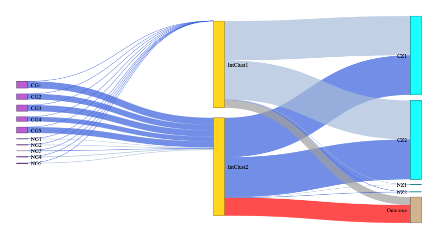
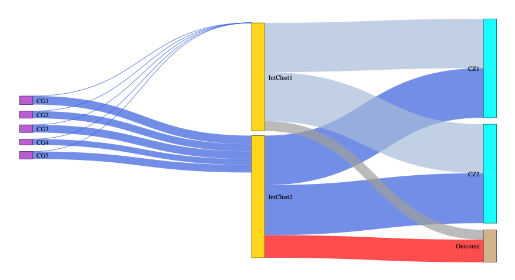

LUCid: Latent or Unobserved Clustering with integrated data
================

Introduction
------------

An R package allows users to achieve a joint estimation of latent or unobserved clusters using multi-omics data with/without the outcome of interest.

Getting Started
---------------

This supplementary package is based on the research paper "Integrative Latent Cluster Assignment Using Multi-Omics Data with Phenotypic Traits" (Under development, will replace this field with a citation when we have one).

### Prerequisites

R (&gt;= 3.1.0).

    Package Dependencies: "mvtnorm", "nnet", "glmnet", "glasso", "lbfgs".

### Installing

We have a plan to submit the package to CRAN/Bioconductor when the development cycle is done.

For now, it can be installed from GitHub using the following codes:

``` r
install.packages("devtools")
devtools::install_github("USCbiostats/LUCid")
```

Otherwise, one can download the package from GitHub, and run the following codes from the parent working directory that contains the LUCid folder:

``` r
install.packages("devtools")
setwd("..")
devtools::install("LUCid")
```

Fitting the latent cluster models
---------------------------------

``` r
library(LUCid)
```

Three functions, including *est\_lucid*, *sem\_lucid*, & *tune\_lucid*, are currently available for model fitting and selection.

### *est\_lucid*

Estimating latent clusters with multi-omics data

#### Example

For a testing dataset with 10 genetic features (5 causal) and 4 biomarkers (2 causal)

##### Integrative clustering without feature selection

``` r
set.seed(10)
IntClusFit <- est_lucid(G=G1,Z=Z1,Y=Y1,K=2,family="binary",Pred=TRUE)
```

#### Checking important model outputs

``` r
summary_lucid(IntClusFit)
```

#### Visualize the results with Sankey diagram using *plot\_lucid*

``` r
plot_lucid(IntClusFit)
```



#### Re-run the model with covariates in the G-&gt;X path

``` r
IntClusCoFit <- est_lucid(G=G1,CoG=CoG,Z=Z1,Y=Y1,K=2,family="binary",Pred=TRUE)
```

#### Check important model outputs

``` r
summary_lucid(IntClusCoFit)
```

#### Visualize the results

``` r
plot_lucid(IntClusCoFit)
```

### *sem\_lucid*

Supplemented EM-algorithm for latent cluster estimation

#### Example

``` r
set.seed(100)
sem_lucid(G=G2,Z=Z2,Y=Y2,useY=TRUE,K=2,Pred=TRUE,family="normal",Get_SE=TRUE,
            def_initial(),def_tol(MAX_ITR=1000,MAX_TOT_ITR=3000))
```

### *tune\_lucid*

#### Example

Grid search for tuning parameters using parallel computing

``` r
# Better be run on a server or HPC
set.seed(10)
GridSearch <- tune_lucid(G=G1, Z=Z1, Y=Y1, K=2, Family="binary", USEY = TRUE,
                           LRho_g = 0.008, URho_g = 0.012, NoRho_g = 3,
                           LRho_z_invcov = 0.04, URho_z_invcov = 0.06, NoRho_z_invcov = 3,
                           LRho_z_covmu = 90, URho_z_covmu = 110, NoRho_z_covmu = 2)
GridSearch$Results
GridSearch$Optimal
```

Run LUCid with best tuning parameters and select informative features

``` r
set.seed(10)
IntClusFit <- est_lucid(G=G1,Z=Z1,Y=Y1,K=2,family="binary",Pred=TRUE,
                        tunepar = def_tune(Select_G=TRUE,Select_Z=TRUE,
                                           Rho_G=0.01,Rho_Z_InvCov=0.06,Rho_Z_CovMu=90))

# Identify selected features
summary_lucid(IntClusFit)$No0G; summary_lucid(IntClusFit)$No0Z
colnames(G1)[summary_lucid(IntClusFit)$select_G]; colnames(Z1)[summary_lucid(IntClusFit)$select_Z]

# Select the features
if(!all(summary_lucid(IntClusFit)$select_G==FALSE)){
    G_select <- G1[,summary_lucid(IntClusFit)$select_G]
}
if(!all(summary_lucid(IntClusFit)$select_Z==FALSE)){
    Z_select <- Z1[,summary_lucid(IntClusFit)$select_Z]
}
```

#### Re-fit with selected features

``` r
set.seed(10)
IntClusFitFinal <- est_lucid(G=G_select,Z=Z_select,Y=Y1,K=2,family="binary",Pred=TRUE)
```

#### Visualize the results with Sankey diagram using *plot\_lucid*

``` r
plot_lucid(IntClusFitFinal)
```



#### Re-run feature selection with covariates in the G-&gt;X path

``` r
IntClusCoFit <- est_lucid(G=G1,CoG=CoG,Z=Z1,Y=Y1,K=ncluster,family="binary",Pred=TRUE,
                          initial=def_initial(), itr_tol=def_tol(),
                          tunepar = def_tune(Select_G=TRUE,Select_Z=TRUE,Rho_G=0.02,Rho_Z_InvCov=0.1,Rho_Z_CovMu=93))
summary_lucid(IntClusCoFit)
```

#### Re-fit with selected features with covariates

``` r
IntClusCoFitFinal <- est_lucid(G=G_select,CoG=CoG,Z=Z_select,Y=Y1,K=ncluster,family="binary",Pred=TRUE)
```

#### Visualize the results

``` r
plot_cluster(IntClusCoFitFinal)
```

For more details, see documentations for each function in the R package.

Built With
----------

-   [devtools](https://cran.r-project.org/web/packages/devtools/index.html) - Tools to Make Developing R Packages Easier
-   [roxygen2](https://cran.r-project.org/web/packages/roxygen2/index.html) - In-Line Documentation for R

Versioning
----------

The current version is 0.6.0.

For the versions available, see the [Release](https://github.com/USCbiostats/LUCid/releases) on this repository.

Authors
-------

-   **Cheng Peng**

License
-------

This project is licensed under the GPL-2 License.

Acknowledgments
---------------

-   Dr. David V. Conti
-   Dr. Zhao Yang
-   USC IMAGE P01 Group.
